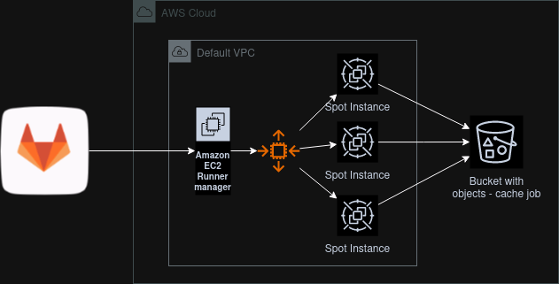

# CI RUNNER SPOT INSTANCE

This repo allow you to create AWS gitlab runner in with spot instaces for execute pipeline job
The mainly reason to use this it's cost reduction.

In this way we have a runner manager that request spot instance only there are tasks to complete.

## Diagram

### steps
1. from gitlab there is a pipeline job to run
2. runner manager trigger spot instance
3. rise up of a spot instance
4. spot instance run-job
5. auto destroy after job-complete

## Importants things

- The Runner manager is t3a.nano
- The Spot instances are t3a.medium
- The runner manager start on 8:00 and shut-down at 20:00
- State of architecture it's in bucket S3 on AWS

## To verify
The runner used by spot istance it's 15.8, so maybe should be possible still use terraform.

## Useful link
- [terraform](https://www.terraform.io/)
- [gitlab-runner-tf-module](https://github.com/cattle-ops/terraform-aws-gitlab-runner)
- [gitlab runner](https://docs.gitlab.com/runner/)
- [how to save up to 90% using aws ec2 spot instance](https://medium.com/@taufiqpsumarna/how-to-saving-gitlab-runner-cost-up-to-90-using-aws-ec2-spot-instance-e9999d08b866)
